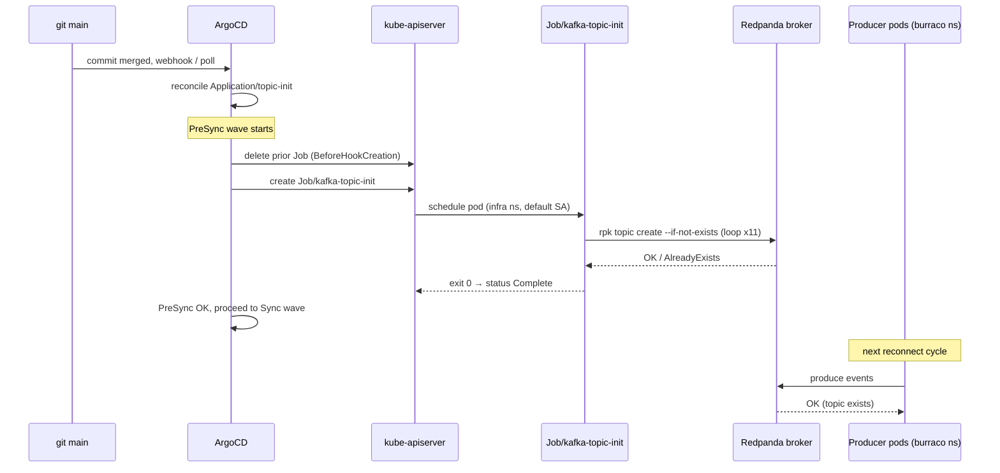

# ADR-0001: Kafka topic provisioning via ArgoCD PreSync hook Job

**Status**: accepted
**Date**: 2026-05-26
**Stories**: docs/stories/2026-05-26-prod-fix-infra/01-kafka-topic-provisioning.feature

## Context

Redpanda is deployed in the `infra` namespace via the upstream Helm chart
`charts.redpanda.com/redpanda` pinned at v5.9.20 (see
`apps/infra/redpanda.yaml`). That chart provisions the broker(s) and the
Schema Registry but does NOT ship a Topic CRD and does NOT create
application topics. Auto-topic-creation on the broker is disabled in
the prod values, by design — we want topic shape (partitions,
replication, retention) to be declared in git rather than implicitly
created by the first producer.

The immediate symptom in prod: Spring producer pods in the `burraco`
namespace are looping on `UNKNOWN_TOPIC_OR_PARTITION` because no one
created the topics. There is no operator (no Strimzi, no
redpanda-operator) installed, and adding one is out of scope for this
fix wave (escalation threshold under the smurf manual — new external
dependency).

The prod Redpanda is a single-broker deployment on a 12 GB VPS, so
replication factor is constrained to **1**. Partition counts come from
the story scenario table (3 partitions per topic, 6 for `game.events`
because game traffic is the throughput hotspot).

Existing GitOps precedent in this repo (see `apps/infra/postgres.yaml`):
an ArgoCD `Application` points `path:` at a `manifests/<thing>/`
directory with `directory.recurse: false` — no `kustomization.yaml`. We
extend that pattern.

## Decision

We ship a Kubernetes `Job` named `kafka-topic-init` under
`manifests/topic-init/` and wire it via a new ArgoCD `Application` at
`apps/infra/topic-init.yaml`. The Job runs `rpk topic create
--if-not-exists` for every application topic and exits 0.

The Job carries the ArgoCD sync-hook annotations:

- `argocd.argoproj.io/hook: PreSync`
- `argocd.argoproj.io/hook-delete-policy: BeforeHookCreation`

**PreSync, not Sync, not PostSync.** Justification:

- **PreSync** runs before the rest of the sync wave for this
  Application. Because topic provisioning is the *prerequisite* for the
  producer Deployments in the `burraco` Application(s) to actually
  reconcile cleanly, we want the Job to land first. The story
  acceptance criterion AC-2 specifies PreSync explicitly.
- **Sync** would let the Job race other resources in the same sync wave —
  no ordering guarantee against producers.
- **PostSync** would only run after a successful sync of everything
  else, which defeats the purpose: producer pods would already have
  started crash-logging UNKNOWN_TOPIC_OR_PARTITION before the Job ran.

`BeforeHookCreation` ensures the previous Job object is deleted before
the new one is created, so each sync produces a fresh, observable Job
run. Combined with `--if-not-exists`, this gives us self-healing
behaviour: if a topic is manually deleted, the next ArgoCD sync
recreates it; if all topics already exist, the Job is a fast no-op and
still exits 0.

**Container image**: `docker.redpanda.com/redpandadata/redpanda:v24.3.1`
(`rpk` is bundled inside the standard Redpanda container). Pinned by
tag — image-digest pinning is a future hardening step but is out of
scope here. The tag pin is the contract; any developer bumping it must
update this ADR.

**RBAC**: the Job runs under the `default` ServiceAccount in the
`infra` namespace. `rpk` talks to the Redpanda broker over the Kafka
admin API at `redpanda.infra.svc.cluster.local:9092` — that is an
in-namespace TCP call, not a Kubernetes API call, so no
ClusterRole / ClusterRoleBinding / Role / RoleBinding is required. AC-6
is satisfied trivially.

**Topic list** (from story scenario table, 11 topics, replication
factor 1):

| topic                  | partitions |
| ---------------------- | ---------- |
| identity.events        | 3          |
| player.events          | 3          |
| social.friends         | 3          |
| social.blocks          | 3          |
| social.messages        | 3          |
| lobby.rooms            | 3          |
| lobby.match-requests   | 3          |
| game.events            | 6          |
| ranking.results        | 3          |
| tournament.events      | 3          |
| notification.requests  | 3          |

The list lives in the Job spec (a shell `for` loop or a small embedded
YAML/script). It is the single source of truth in this repo. If the
application repo's `common-events/src/main/avro/` diverges, the
`--if-not-exists` semantics mean surplus topics are harmless and
missing topics will be created on the next sync — see Open Questions.

## Consequences

- **positive**:
  - Topics declared in git, reconciled by ArgoCD — full GitOps.
  - Idempotent: safe on every sync, self-heals accidental deletions.
  - No new operator, no new CRD, no new RBAC surface — minimum diff.
  - Replication-factor 1 matches the prod single-broker reality; no
    misleading "RF=3 on paper, RF=1 in reality" drift.
- **negative**:
  - Topic *shape changes* (e.g. raising partitions, changing retention
    on an existing topic) are NOT handled by `rpk topic create
    --if-not-exists`. A future ADR will cover topic-shape evolution
    (likely `rpk topic alter` with an explicit migration runbook).
  - The topic list is duplicated between this Job and the AI-burraco
    `common-events` Avro schemas. Drift is possible (see AC-7).
  - The `rpk` image tag is a manual pin — no Renovate config yet.
- **neutral**:
  - PreSync hook delete policy creates one short-lived Job per sync.
    Log retention for these Jobs is bounded by Loki's namespace policy.

## Ports / Adapters (or modules)

- **Inbound**: ArgoCD reconcile loop → creates `Application/topic-init`
  → on first sync (and every subsequent sync), the PreSync hook
  materialises `Job/kafka-topic-init` in namespace `infra`.
- **Outbound (intra-cluster)**: Job pod opens a Kafka admin connection
  to `redpanda.infra.svc.cluster.local:9092` via `rpk`. No external
  network egress.
- **Downstream effect**: Spring producer pods in the `burraco`
  namespace, on their next connection attempt, find the topics and stop
  emitting `UNKNOWN_TOPIC_OR_PARTITION`. No code change in the producers.
- **No new external dependency**: the Redpanda image is already pulled
  by the broker StatefulSet; we are reusing a binary that is already in
  the supply chain.

## Sequence

## Alternatives considered

1. **Redpanda Topic CRD via redpanda-operator** — rejected. The Helm
   chart at v5.9.20 we are using does NOT install the operator or the
   Topic CRD; installing it would be a new external dependency and a
   net-new RBAC surface. Reconsider when we adopt the operator
   independently for other reasons.
2. **initContainer per Spring service** — rejected. Duplicates the
   topic-list across N microservice charts, cross-service coupling
   (which service "owns" topic creation?), and the initContainer cannot
   guarantee its topics exist before *other* services' producers
   reconcile.
3. **Set `auto.create.topics.enable=true` on the broker** — rejected.
   Creates topics with broker-default partitioning (1 partition), which
   silently violates the story's partition-count contract and is
   impossible to evolve safely (no shape declared anywhere).
4. **One-shot manual `kubectl exec` into the broker pod** — rejected.
   Violates the GitOps-only NFR; not reproducible across cluster
   rebuilds.

## Risks and mitigations

- **rpk image-tag drift**: pinned to `v24.3.1`; any bump must update
  this ADR and the manifest in the same commit. Future: image-digest
  pin + Renovate rule.
- **Topic list drift** vs `common-events/src/main/avro/` in the app
  repo: documented as AC-7 (open) on the story; `--if-not-exists` makes
  surplus topics tolerable; missing topics become a producer-side error
  visible in logs and Loki alerts.
- **Topic-shape evolution**: out of scope here; a future ADR (provisional
  ADR-0003) will cover `rpk topic alter`-based migrations.
- **Partition count for `game.events`** (6 vs 3 for others): unverified
  against measured load; sized based on the story's "throughput
  hotspot" annotation. Treat as a default that may need to grow.

## Open questions

1. **Topic-list ground truth (AC-7 on the story)**: brief says 11
   topics, the AI-burraco PR's `kafka-topics.list` has 9. Developer
   wave must cross-check with `common-events/src/main/avro/` in the
   AI-burraco repo before merging. If the app only actually publishes
   to 9, the 2 surplus topics in this Job are harmless but should be
   removed in a follow-up to keep the spec honest. Resolve via
   SendMessage to architect (this ADR) as advisor.
2. **`rpk topic create` connection auth**: does prod Redpanda require
   SASL on the internal listener, or is `9092` an unauthenticated
   intra-namespace listener? If SASL, the Job needs a secretRef for
   admin creds and this ADR must be amended. Developer wave to verify
   against `environments/prod/infra/redpanda-values.yaml`.
3. **Retention / cleanup.policy per topic**: not specified in the
   story. Default broker retention applies (7 days, delete). If any
   topic needs `compact` (e.g. `*.snapshots`, currently not in the
   list), it is a separate concern. Out of scope here; flagged for a
   follow-up ADR if/when compaction topics appear.
