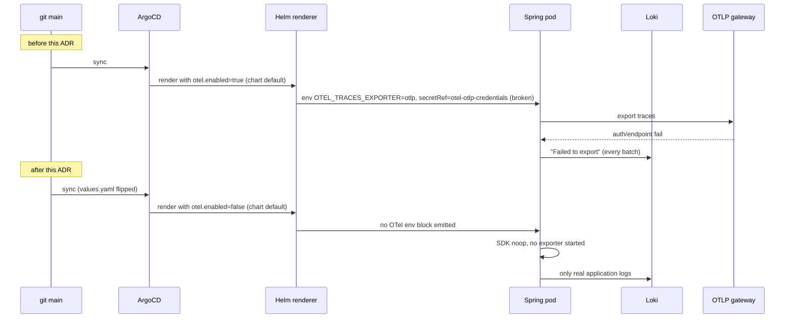

# ADR-0002: Default `otel.enabled` to `false` in the spring-microservice chart

**Status**: accepted
**Date**: 2026-05-26
**Stories**: docs/stories/2026-05-26-prod-fix-infra/02-disable-otel-default.feature

## Context

`charts/spring-microservice/values.yaml` currently ships
`otel.enabled: true` as the default. Every Spring service rendered by
this chart therefore initialises the OpenTelemetry SDK on startup with
the OTLP exporter pointed at a Grafana Cloud gateway whose endpoint and
auth headers come from the SealedSecret `otel-otlp-credentials` in the
`burraco` namespace (see `environments/prod/secrets/`).

In prod **right now**, that SealedSecret is not decrypting in-cluster
(the master key in `environments/prod/secrets/sealed-secrets-master-key.yaml`
does not match the resealing key that was used). The chart treats the
secretRef as optional — pods come up, the SDK warns instead of
crashing — but every service then loops "Failed to export" against the
gateway and floods Loki. The signal-to-noise ratio on prod logs is now
unworkable.

Investigation cost of fixing the SealedSecret is non-trivial: it
involves either re-sealing all OTel credentials with the correct
controller key or rotating the master. That work is real but separate
and will get its own story. Meanwhile we need a clean log stream now,
and we need the chart's *default* to reflect the cluster's *actual*
working state.

We considered scoping the disable per-service via the per-service
override files (e.g. `environments/prod/values-identity-service.yaml`,
`environments/prod/values-lobby-service.yaml`, etc.). That works
mechanically but is the wrong shape: the broken artefact is one
cluster-wide SealedSecret consumed identically by every Spring service.
Disabling "per service" would mean editing ~9 files for what is really
one decision. Equally, when we re-enable, we want it to come back at
the chart-default level, not as N scattered overrides.

## Decision

We flip `charts/spring-microservice/values.yaml`'s `otel.enabled`
default from `true` to `false`. The change is a one-line value flip
plus a multi-line YAML comment dated **2026-05-26** that:

1. States the reason: SealedSecret `otel-otlp-credentials` is not
   decrypting in-cluster.
2. Points at the reactivation runbook (the developer wave fills in the
   final runbook path — a placeholder is acceptable for the merge, see
   Open Questions).
3. Records the reactivation criteria: once the SealedSecret is verified
   to decrypt and a smoke test confirms traces arrive in Grafana
   Cloud, either (a) flip this default back to `true`, or (b) opt
   services in individually via `environments/prod/values-<svc>.yaml`.

The per-service opt-in path remains intact — Helm value merging makes
any `otel.enabled: true` in a `values-<svc>.yaml` override this default
cleanly. The story's Scenario "Per-service opt-in override continues
to work" is satisfied by Helm semantics, not by any code change.

No environments/prod/values-*.yaml file is modified in this change.
No secret is rotated. No code in `templates/` is changed. The chart
template still reads `.Values.otel.enabled` and conditionally renders
the OTel env-vars / secretRef the same way it does today.

## Consequences

- **positive**:
  - Loki query `{env="prod"} |~ "Failed to export"` drops to near-zero
    within one sync cycle (story AC-4).
  - Real production errors stop being masked by exporter noise.
  - The chart default now reflects reality: tracing is currently NOT
    working in prod, and the chart should not lie about that.
  - Single-line revert restores the prior behaviour (story AC-6 and the
    NFR "Reversible").
- **negative**:
  - **Brief tracing blackout**: from merge until either (a) the
    SealedSecret is fixed and the default flipped back, or (b) a
    service is opted in via its `values-<svc>.yaml`. This is
    acceptable because tracing was NOT actually working: there is no
    functional regression, only a removal of failed export attempts.
  - We must remember to re-enable; the runbook reference in the YAML
    comment is the durable reminder. There is no automated alert that
    fires "tracing is off". A monitoring follow-up may be appropriate.
- **neutral**:
  - Metrics and logs are unaffected — those are scraped by Grafana
    Alloy (Prometheus + Loki), not by the OTel exporter. The whole
    "tracing distinct from metrics/logs" comment block in `values.yaml`
    already explains this; we extend it.

## Ports / Adapters (or modules)

- **Configuration port**: `charts/spring-microservice/values.yaml :: otel`
  block. Consumer is every templated Spring service. Implementation:
  Helm value merging at install/upgrade time.
- **Opt-in adapter (unchanged)**: `environments/prod/values-<svc>.yaml`
  may override `otel.enabled: true` per service. ArgoCD's `helm.values`
  resolution picks this up at sync time. No new file is required to
  exercise this path.
- **No new inbound or outbound integrations**. This ADR removes a
  failing outbound integration (OTLP export to Grafana Cloud) at the
  default level only. The egress pathway, secret schema, and template
  rendering all remain in place for the eventual reactivation.

## Sequence

## Alternatives considered

1. **Fix the SealedSecret first**: correct on principle but it blocks
   immediate log-noise cleanup behind a key-management investigation
   that has no SLA. We do it as a separate story and unblock now.
2. **Per-service disable in `environments/prod/values-<svc>.yaml`**:
   rejected. ~9 files for one decision; symmetric N-way revert when
   we re-enable; the broken artefact is cluster-wide so the fix
   should be too.
3. **Template-level removal of the OTel block**: rejected. Destroys
   the reactivation path. We want a config flip, not a template
   amputation.
4. **Add a global cluster-wide ArgoCD parameter**: rejected.
   Over-engineered for a one-line default change.

## Open questions

1. **Runbook reference**: the YAML comment must point at a real
   reactivation runbook. Either an existing
   `environments/prod/secrets/README.md` section, or a new
   `docs/runbooks/otel-reactivation.md`. Developer wave decides and
   fills in the path; if creating a new runbook, that is a separate
   minor commit. Surface back to architect via SendMessage if you want
   the runbook scope captured as its own story.
2. **Monitoring follow-up**: do we want a synthetic alert like "no
   traces received in 24h from prod" so we don't quietly run blind for
   weeks? Out of scope here, candidate for a follow-up story.
3. **Re-enable trigger**: once the SealedSecret is fixed, who/what
   re-flips the default? This ADR documents the reactivation path but
   not the trigger ownership. The architect's view: the same story
   that fixes the SealedSecret should include flipping this default
   back, so the two changes land atomically.
